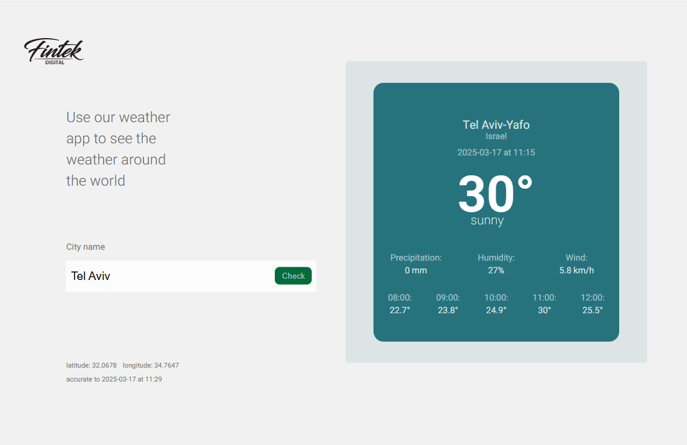

# Weather App 🌤️

A simple weather web application built using React (Frontend) and Node.js (Backend).  
The app fetches weather data from [WeatherAPI.com](https://www.weatherapi.com/) and displays it based on the user's input.

## Screenshot  


## Features
- Search for a city and get real-time weather data.
- Responsive design (works on desktop, tablet, and mobile).
- Handles errors (invalid input, empty results).


## Tech Stack
- **Frontend:** React, CSS ,Axios
- **Backend:** Node.js, Express, Axios, Dotenv, Cors, Https
- **API:** WeatherAPI.com

## Setup Instructions
#### 1 Clone the repository  

```sh
git clone https://github.com/Shoshi1766/Weather-around-the-world.git
cd Weather-around-the-world
```
#### 2 Install Backend dependencies
```sh
cd Backend
```
```sh
npm i
```
#### 3 Install Frontend dependencies
```sh
cd ../Frontend
```
```sh
npm i
```
#### 4 Configure Environment Variables in Backend folder
```sh
PORT=8080
KEY_WEATHER_API=ddf77ca6450942c19f0132222250503
```
#### 5 Start the Backend server
```sh
cd ../Backend
```
```sh
npm start
```
#### 6 Start the Frontend
```sh
cd ../Frontend
```
```sh
npm start
```
#### The Frontend will be available at http://localhost:5173